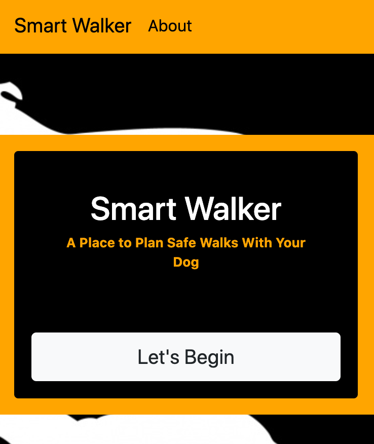

# Smart Walker

## Description

This application allows you view the times of the day that are safest for walks with your dog. Our furry companions are not impervious to extreme weather conditions and, as owners, we must be mindful of their safety.

After entering your zip code or city/state, you will be presented with an hourly forecast for the next 48 hours. The temperatures listed will be colored either red, yellow, or green.

        Temperatures colored red represent temperatures that pose a serious threat to your dog’s health (less than 15°F and greater than 95°F). At these temperatures, you should avoid walking your dog outside regardless of age, breed, or physical condition.

        Temperatures colored yellow represent temperatures that could pose a threat to your dog’s health if they are outside for a prolonged amount of time (15-45°F or 75-90°F). At these temperatures, you should take caution when walking your dog outside and take into account their age, breed, and physical condition.

        Temperatures colored green mean that it is safe for just about any dog- have fun!

`See the URL for the deployed appliation:` https://smart-walker.herokuapp.com/

## Table of Contents

- [Installation](#installation)
- [Usage](#usage)
- [License](#license)
- [Questions](#questions)

## Installation

- While in the root directory, run: `npm install`
- After all installations complete, run: `npm start`
- View the app running on <http://localhost:3000>

## Usage

Use this app anytime you are unsure of whether or not it is safe to take your dog out on a walk.

## License

## Questions

For any additional questions, please send me an e-mail at jackson.meier423@gmail.com

Link to my GitHub: https://github.com/meierj423
